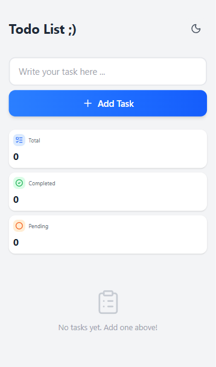
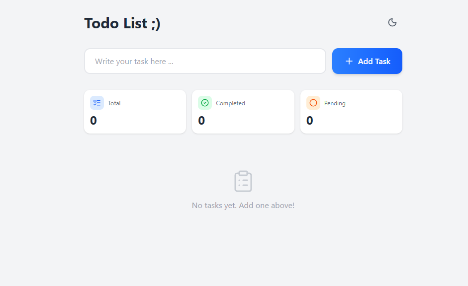

# 📝 Todo List

A minimal, responsive todo app built with React + TypeScript + Tailwind CSS v4.

🔗 **[Live Demo](https://taskflow-app-puce-two.vercel.app)**

<p align="center">
  
  &nbsp;&nbsp;
  
</p>
<p align="center">
  <sub>Mobile · Desktop</sub>
</p>

## ✨ Features

- ➕ Add, edit, and delete tasks
- ✅ Mark tasks as complete
- 🔍 Filter by all / pending / completed
- 🌙 Dark mode with system preference detection
- 💾 Auto-save to localStorage
- 📱 Fully responsive (280px+)
- ♿ Keyboard accessible with focus-visible styles

## 🛠️ Tech Stack

- **React 19** — UI library
- **TypeScript** — Type safety
- **Vite** — Build tool
- **Tailwind CSS v4** — Styling
- **Lucide React** — Icons

## 🚀 Getting Started

```bash
# Install dependencies
npm install

# Start dev server
npm run dev

# Build for production
npm run build
```

## 📁 Project Structure

```
src/
├── components/     # UI components
├── constants/      # App-wide constants
├── hooks/          # Custom React hooks
├── types/          # TypeScript types
└── App.tsx
```

## 🎯 Design Decisions

- **Custom hooks** for separation of concerns (`useTodos`, `useFilter`, `useTheme`, `useLocalStorage`)
- **Co-located types** — component props live with their components, domain types live in `types/`
- **Centralized constants** — filters, storage keys, and themes in `constants/`
- **Theme persistence** — respects system preference and remembers user choice

## 🌐 Deployment

Deployed on [Vercel](https://vercel.com). Every push to `main` triggers an automatic deployment.

## 📄 License

MIT
